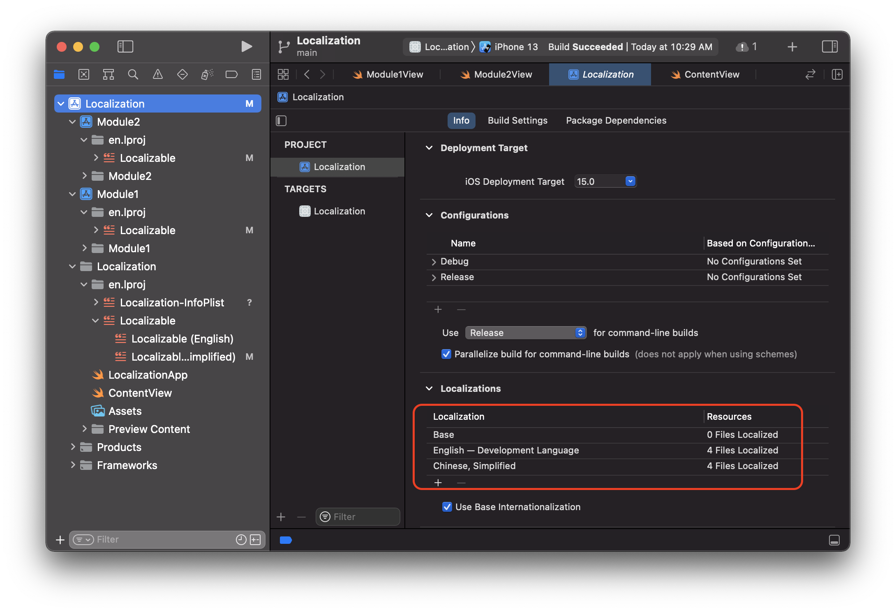
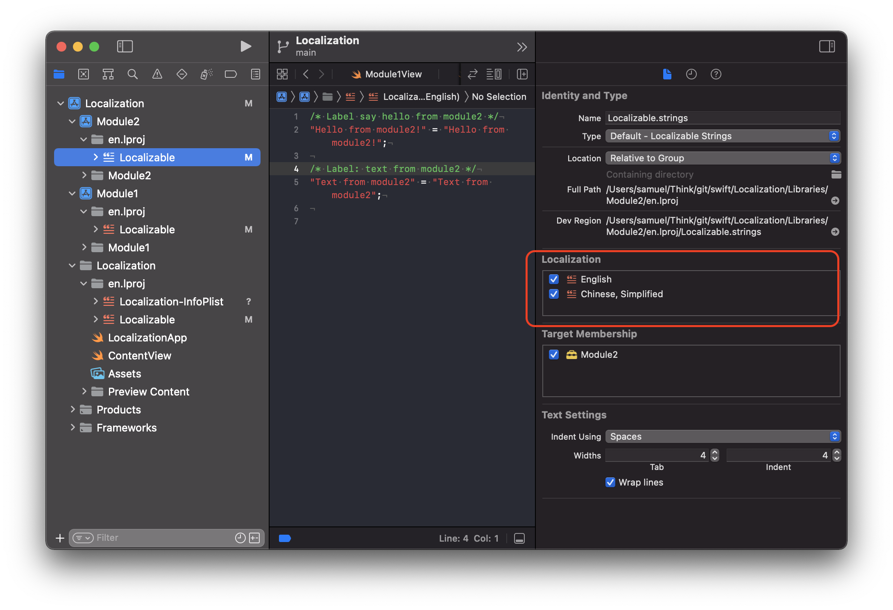

# Localization

## 0. 添加多语言支持的正确步骤

- 1.使用合适的字符串格式, 用SwiftUI或者UIKit构建界面
- 2.导出localization
- 3.添加多语言支持
- 4.导入xliff文件
- 5.整理添加可能的Plura字符串

后续只需要重复2 -5 步骤即可. 下面详细介绍每个步骤.

[官方文档](https://developer.apple.com/library/archive/documentation/MacOSX/Conceptual/BPInternational/LocalizingYourApp/LocalizingYourApp.html#//apple_ref/doc/uid/10000171i-CH5-SW1)

## 1. 添加字符串
> 1. UI中使用字符串

```swift
  VStack {
      Text("Hello from module1!", bundle: .main, comment: "Label: show hello from module1")
  }
```
> 2. ViewModule中使用字符串

```swift
var text1 = String(localized: "\(count) ticket(s)", bundle: .main, comment: "Label: quantities of tickets")
```
> 3. ViewModule中使用字符串

```swift
var text2: LocalizedStringKey = "Hello text2 from module1"
```
注意方法3无法指定bundle, 因此如果是定义在framework中的代码, 要使用自己的bundle, 可以使用方法1和2.


## 2. 导出localization

### 2.1 导出

可以导出workspace中各个project的localization, 也可以导出全部, 菜单入口: Product/Export Localizations/, 指令:
```bash
xcodebuild \
  -workspace "Localization.xcworkspace" \
  -exportLocalizations \
  -localizationPath "export" \
  -exportLanguage en \
  -exportLanguage de \
  ...
```
### 2.2 可能的错误

导出localization通常都会报莫名其妙的错误, 错误信息如下图:

<div align=center></div>

命令行错误如图:

```bash
xcodebuild: error: Unable to build project for localization string extraction
	Reason: Failed to build.
	Please see the build logs for failure description.
```

Xcode(13.2.1)的exportLocalizations有2个问题:
- 无法处理依赖关系, 导致编译错误
- 默认依赖`arm64`架构, `Release`模式(project设置有一项:`Use release for command-line build`, 指定scheme的除外), 但是无法指定.

### 2.3 解决方案
解决的方案是手动编译一遍, 在编译时指定架构`archs=arm64`, 指定模式`-configuration Release`(根据错误切换Debug还是Release)

[script](./resource/export.sh):

```bash
#!/usr/bin/env bash

set -euo pipefail

xcodebuild ARCHS=arm64 ONLY_ACTIVE_ARCH=NO -configuration Release \
  -workspace "Localization.xcworkspace" \
  -scheme "Localization" > /dev/null 2>&1

xcodebuild -quiet \
  -exportLocalizations \
  -localizationPath "export" \
  -exportLanguage en
```

## 3. 添加多语言支持

### 3.1 拷贝

由于目前project中还没有`Localizable.strings`文件, 需要从export目录中拷贝过来.

```bash
cp -r export/en.xcloc/Source\ Contents/ ./
```

然后添加到project文件中

### 3.2 添加支持的多语言

> 1. 为project添加localization支持
<div align=center></div>

> 2. 为字符串文件添加对应的localization

<div align=center></div>

## 4. 导入

导出的`xliff`文件可以拿给翻译团队进行翻译了, 翻译完会生成对应的`de.xliff`, `zh-Hans.xliff`等文件, 把这些文件导入到工程即可.

> 注意: 导入的本质是merge的过程, 必须要有diff才能生效.

因此有2个条件必备:
1. project必须有`Localizable.strings`文件, 并且这个文件是localize过的(在比如`en.lproj`目录里)
2. 有翻译发生 - 即`.xliff`文件中的`target`字符串有修改


```bash
xcodebuild -workspace "Localization.xcworkspace" -importLocalizations -localizationPath ./zh-Hans.xliff
```

## 5. Plura复数支持

在自动生成的`Localizable.strings`文件中可以看到一些带`%lld, %d`的字符串, 需要进行复数处理([官方文档](https://developer.apple.com/documentation/xcode/localizing-strings-that-contain-plurals)).

比如例子中的`%lld ticket(s)`就需要进行复数处理.

> 需要进行复数处理, 是因为不同语言在处理不同数量时, 使用的表示方法不同, 比如中文中一个苹果与多个苹果都是 `苹果`, 而英文中有`apple`和`apples`的区别, 有些语言比如俄语, 阿拉伯语, 甚至一个, 两个, 三个的表示方式都是不同的.

## 6. 子模块的多语言支持

一般的项目中会包含多个模块, 每个模块都是单独的framework, 有自己的project, 因此导出的时候有自己的字符串文件.

如果需要读取本module的字符串文件, 需要指定bundle, 方案可以参考swift package的方法:

```swift
import class Foundation.Bundle

private class BundleFinder {}

extension Foundation.Bundle {
    /// Returns the resource bundle associated with the current Swift module.
    static var module: Bundle = Bundle(for: BundleFinder.self)
}

...
Text("Text3 from module1", bundle: .module, comment: "Label: show Text3 from module1")
...
```

## 7. Screenshots

[官方文档](https://developer.apple.com/documentation/xcode/creating-screenshots-of-your-app-for-localizers)

[About screenshot](https://rderik.com/blog/understanding-xcuitest-screenshots-and-how-to-access-them/)

### 7.1 UI test

### 7.2 Test plan


# 4. 参考

[官方文档](https://developer.apple.com/documentation/xcode/exporting-localizations)

[About screenshot](https://rderik.com/blog/understanding-xcuitest-screenshots-and-how-to-access-them/)

[WWDC2021](https://developer.apple.com/videos/play/wwdc2021/10220/)