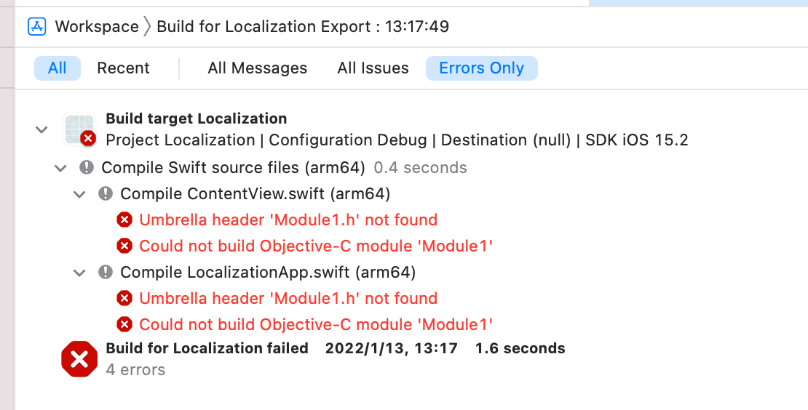

# Localization

## 1. 添加字符串

## 2. 添加多语言支持

## 3. 导出localization

### 3.1 导出

可以导出workspace中各个project的localization, 也可以导出全部, 菜单入口: Product/Export Localizations/, 指令:
```bash
xcrun xcodebuild \
  -workspace "Localization.xcworkspace" \
  -scheme "Localization" \
  -exportLocalizations \
  -localizationPath "export" \
  -exportLanguage en \
  -exportLanguage de \
  ...
```
### 3.2 可能的错误
<div align=center></div>

Xcode(13.2.1)这里有一个bug, 不会根据依赖关系编译工程, 注意这个错误里面的`arm64`.
```bash
xcodebuild: error: Unable to build project for localization string extraction
	Reason: Failed to build.
	Please see the build logs for failure description.
```

### 3.3 Fix
只需要手动编译一遍对应的架构`arm64`即可. 或者可以写个脚步先编译一遍工程生成`arm64`架构[script](./resource/export.sh):

```bash
#!/usr/bin/env bash

set -euo pipefail

xcrun xcodebuild ARCHS=arm64 ONLY_ACTIVE_ARCH=NO \
  -workspace "Localization.xcworkspace" \
  -scheme "Localization" \
  -configuration Debug > /dev/null 2>&1

xcrun xcodebuild \
  -workspace "Localization.xcworkspace" \
  -scheme "Localization" \
  -configuration Debug \
  -exportLocalizations \
  -localizationPath "export" \
  -exportLanguage en
```

# 4. 参考

[官方文档](https://developer.apple.com/documentation/xcode/exporting-localizations)