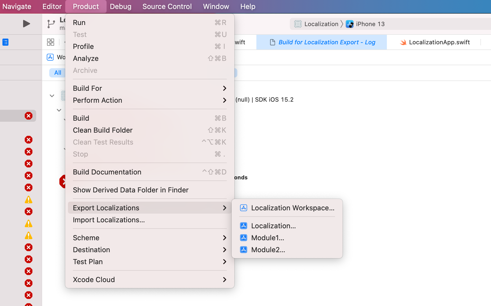

# Localization

## 1. 添加字符串

## 2. 添加多语言支持

## 3. 导出localization

> 3.1 导出

可以导出workspace中各个project的localization, 也可以导出全部, 入口地址: Product/Export Localizations/

>  3.2 可能的错误

> 3.3 

# 4. 参考

[官方文档](https://developer.apple.com/documentation/xcode/exporting-localizations)