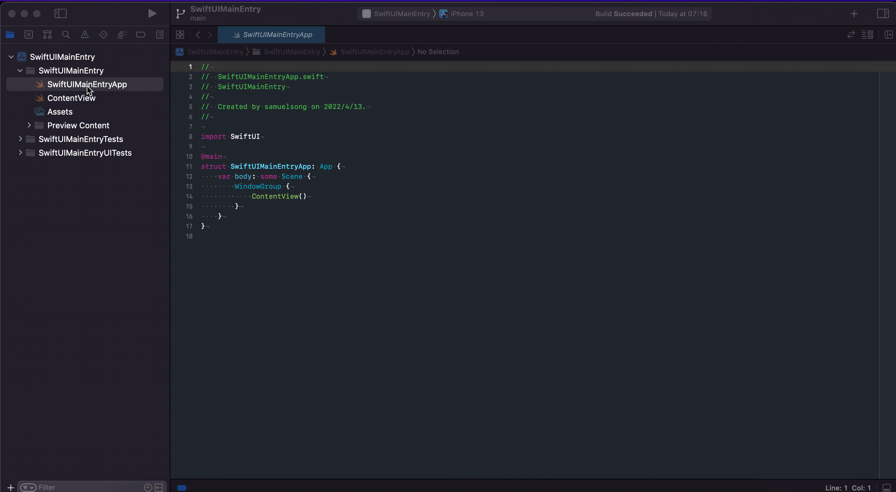

# Simple Tabview Application

# 1. 基于SwiftUI的应用程序



## 1.1 入口与主界面
```swift
import SwiftUI

@main
struct SwiftUIMainEntryApp: App {
    var body: some Scene {
        WindowGroup {
            ContentView()
        }
    }
}
```

与`Objective-C`应用程序不同, 基于`SwiftUI`的应用程序直接呈现的是主界面的构造代码, 程序入口和初始化被简化隐藏了. 主入口被简化成了一个`@main`标签, 该标签要求实例提供一个全局静态`main`函数作为入口, 全局只能有一个标识为`@main`的实例.
```swift
public static func main()
```

## 1.2 自定义初始化

那么初始化操作该如何进行呢?答案是`@UIApplicationDelegateAdaptor`.

```swift
@main
struct SwiftUIMainEntryApp: App {
    // swiftlint:disable:next weak_delegate
    @UIApplicationDelegateAdaptor(AppDelegate.self) var appDelegate

    var body: some Scene {
        WindowGroup {
            appDelegate.createContentView()
        }
    }
}

class AppDelegate: NSObject, UIApplicationDelegate, UISceneDelegate {

    override init() {
        super.init()
    }

    func createContentView() -> some View {
        ContentView()
    }

    func application(_ application: UIApplication,
                     didFinishLaunchingWithOptions launchOptions: [UIApplication.LaunchOptionsKey: Any]? = nil) -> Bool {
        return true
    }
}

```
我们可以自定义一个实现`UIApplicationDelegate`协议的类进行初始化操作.

# 2. Simple MVVM application
下面是一个简单的基于`TabView`的应用程序展示如何进行初始化以及创建主界面, 样式如下.


## 2.1 View and View Model

由于没有涉及到与外部的数据交互, 因此这里只有`view`和`view model`, 并没有`MVVM`中的第一个`M: model`.

> view model

```swift
class RootViewModel: ObservableObject {
    @Published var tabList: [RootViewModelItem]
    var selected: TabType = .home

    init() {
        tabList = [
            .init(id: .home, title: "Home", image: Image(systemName: "house"), backgroundColor: .red),
            .init(id: .setting, title: "Setting", image: Image(systemName: "gear"), backgroundColor: .blue)
            ]
    }
}
enum TabType: Int, Hashable {
    case home, setting
}

struct RootViewModelItem: Identifiable {
    var id: TabType
    var title: LocalizedStringKey
    var image: Image
    var backgroundColor: Color
}

```

> view

```swift
struct RootView: View {
    @ObservedObject var viewModel: RootViewModel

    var body: some View {
        TabView(selection: $viewModel.selected) {
            ForEach (viewModel.tabList) { item in
                tabView(item)
                    .tabItem {
                        item.image
                        Text(item.title)
                }
            }
        }
    }

    func tabView(_ item: RootViewModelItem) -> some View {
        NavigationView {
            ZStack {
                item.backgroundColor
                Text(item.title)
            }.navigationTitle(item.title)
        }
    }
}

```

## 2.2 初始化与主界面构造

> 入口与初始化

```swift
@main
struct SimpleApp: App {

    @UIApplicationDelegateAdaptor var appDelegate: AppDelegate

    var body: some Scene {
        WindowGroup {
            appDelegate.createRootView()
        }
    }
}

```

> 主界面构造

```swift
class AppDelegate: NSObject, UIApplicationDelegate {
    private let rootViewModel: RootViewModel

    override init() {
        rootViewModel = RootViewModel()
    }

    func createRootView() -> some View {
        return RootView(viewModel: rootViewModel)
    }
}

```
