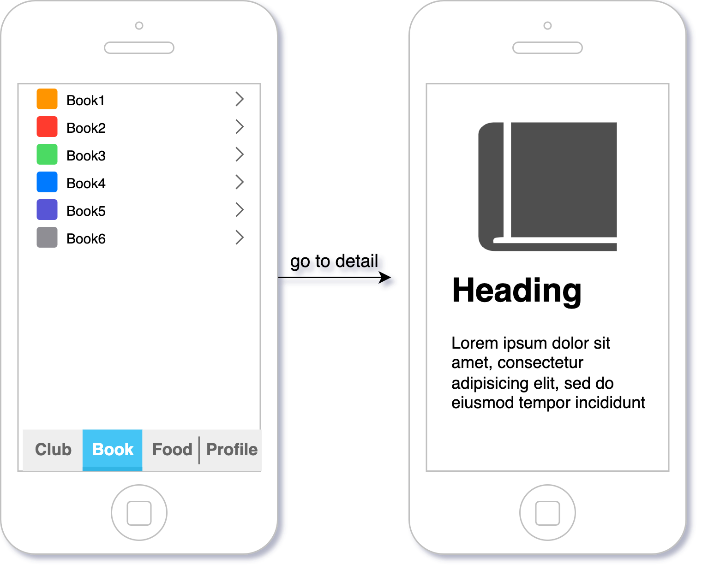

# MVP - Minimum Viable Product

Compose a radio group picker for iOS, declared as below:

## 1. Target

try to build a MVP with SwiftUI, and try to do all kinds of best practice.
The MVP is a basic application with 2 tabs and can be navigated into secondary page from list.

As we can see, we are gonna build a 4-tab based application, each page is a list page, and can then navigate into a detailed page.

## 2. Basic architecture of the application

we can create the basic structure based on this post.

## 3. How to module?

## 4. Do we need a coordinator?
MVVM vs MVVMC

## 5. Dependency Injection

## 6. Navigator

## 7. Dark mode

## 8. Test

## 9. Localization

## 10. Tracking

## 11. Remote config

